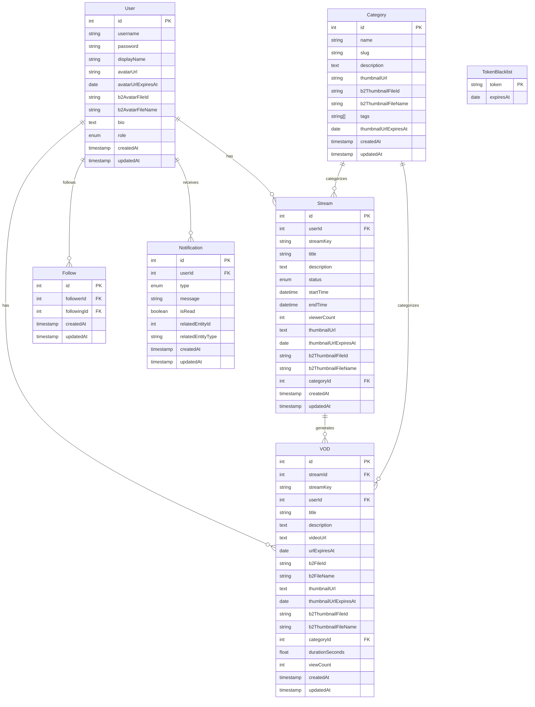
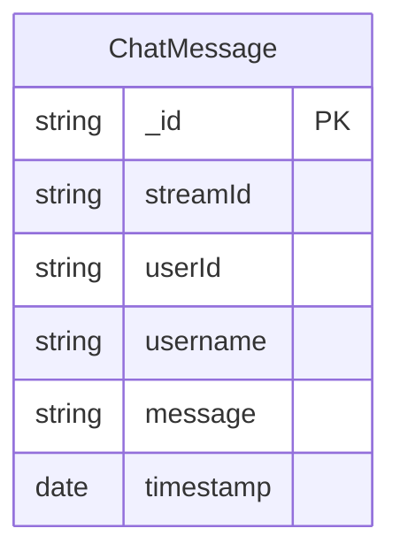

# Database Schema Documentation

## PostgreSQL Schema

## MongoDB Schema

## Table Descriptions

| Table/Collection | Database Type | Purpose                                                                                                 |
| ---------------- | ------------- | ------------------------------------------------------------------------------------------------------- |
| User             | PostgreSQL    | Stores user account information, authentication details, profile data, and user roles                   |
| Stream           | PostgreSQL    | Manages live streaming sessions including metadata, status, viewer counts, and references to thumbnails |
| VOD              | PostgreSQL    | Stores video-on-demand recordings from past streams with metadata, URLs, and viewer statistics          |
| Category         | PostgreSQL    | Contains categories for streams and VODs with descriptions and thumbnail images                         |
| Follow           | PostgreSQL    | Tracks user follow relationships (who follows whom)                                                     |
| Notification     | PostgreSQL    | Stores user notifications for events like new followers, stream starts, and new VODs                    |
| TokenBlacklist   | PostgreSQL    | Tracks invalidated JWT tokens for authentication security                                               |
| ChatMessage      | MongoDB       | Stores chat messages sent during livestreams                                                            |

## Relationships

- Users can have multiple Streams and VODs
- Streams can generate multiple VODs
- Categories can be associated with multiple Streams and VODs
- Users can follow multiple other users (via Follow table)
- Users can receive multiple notifications
- Each Stream can have multiple chat messages in MongoDB

## Luồng Hoạt Động Hệ Thống

### Quy Trình Xác Thực Người Dùng

- Người dùng đăng ký và đăng nhập thông qua ứng dụng web
- Xác thực được quản lý thông qua JWT tokens
- Các token không hợp lệ được theo dõi trong bảng TokenBlacklist

### Quy Trình Phát Sóng

1. Người dùng tạo stream mới và nhận stream key cùng URL RTMP
2. Người dùng bắt đầu phát sóng sử dụng OBS/XSplit thông qua giao thức RTMP
3. Máy chủ Nginx RTMP nhận luồng stream và:
   - Kích hoạt webhooks đến các dịch vụ backend
   - Đánh dấu stream là "đang phát sóng" trong cơ sở dữ liệu
   - Chuyển đổi stream sang định dạng HLS/DASH cho người xem
   - Gửi thông báo đến người theo dõi thông qua BullMQ

### Hệ Thống Thông Báo

- Thông báo được đưa vào hàng đợi BullMQ (được hỗ trợ bởi Redis)
- Các quy trình consumer xử lý việc gửi thông báo
- Socket.IO gửi thông báo thời gian thực đến người theo dõi
- Thông báo được lưu trữ trong PostgreSQL để duy trì

### Trải Nghiệm Người Xem

- Người xem theo dõi stream thông qua trình phát web nhận luồng HLS/DASH
- Tin nhắn chat trong khi stream được lưu trữ trong MongoDB
- Chat thời gian thực được hỗ trợ bởi Socket.IO
- Số lượng người xem được quản lý và cập nhật thông qua Redis

### Hệ Thống VOD

1. Khi stream kết thúc, máy chủ Nginx RTMP kích hoạt webhook đến backend
2. Backend đánh dấu stream đã kết thúc
3. Stream được xử lý và lưu trữ dưới dạng VOD trong B2 bucket
4. Khi tải lên hoàn tất, người theo dõi được thông báo qua cùng hệ thống thông báo
5. Lượt xem VOD được giới hạn tốc độ (một lượt xem mỗi người dùng mỗi 5 phút) sử dụng Redis

### Sử Dụng Cơ Sở Dữ Liệu

- PostgreSQL: Dữ liệu có cấu trúc (người dùng, stream, VOD, danh mục, theo dõi, thông báo)
- MongoDB: Dữ liệu không cấu trúc (lịch sử tin nhắn chat)
- Redis:
  - Quản lý người xem trực tuyến
  - Đếm kết nối cho mỗi người dùng/stream
  - Đếm và phát sóng số lượng người xem duy nhất
  - Lưu trữ backend cho BullMQ
  - Giới hạn tốc độ đếm lượt xem VOD
